# 🚀 Dinesh H Suthar

> **Performance-focused Backend & Blockchain Engineer**  
> Building high-throughput Java microservices and gas-efficient blockchain systems. I design, benchmark and ship production services that are **low-latency**, **resilient** and **observable**.

---

## ⚡ Quick Snapshot

- 🎯 Performance-focused backend engineer (Java, Spring Boot) with hands-on experience in distributed systems, low-latency architectures, and event-driven pipelines
- 💼 Internship experience in backend & performance engineering at **Samsung PRISM**
- 🏆 **700+ LeetCode & Codeforces problems solved** — mastering algorithmic patterns and competitive programming
- 📦 Practical track record: end-to-end projects deployed on **Kubernetes** with verified **Locust benchmarks** and CI integration

---

## 💪 Core Strengths

| Domain | Skills |
|--------|--------|
| ⚙️ **Backend Performance** | Profiling, eBPF, lock-free patterns, low-latency engineering |
| 🌐 **Distributed Systems** | Kafka, idempotency, partitioning, event-driven architectures |
| ☕ **Production Java** | Spring Boot, concurrency, memory profiling, JVM tuning |
| 📊 **Observability** | Prometheus, Grafana, SLOs, structured logging, distributed tracing |
| 🔬 **Benchmarking** | JMH, Locust, performance regression, CI integration |

---

## 🛠️ Technical Stack (Production-Oriented)

```
🔥 Primary:     Java (OpenJDK 17), Spring Boot (Core, Data, Security)
🌟 Secondary:   Python, TypeScript, FastAPI
💾 Data & Infra: PostgreSQL, Redis (caching), Kafka (streaming), Docker, Kubernetes, AWS
⚡ Performance:  LMAX Disruptor, eBPF, JMH, Locust, perf
📈 CI & Ops:    GitHub Actions, Prometheus, Grafana, tracing & centralized logs
```

---

## 🎯 Selected Projects (Concise & Measurable)

### 🔐 Supply Chain Authentication System

**Stack:** `Spring Boot` • `Kafka` • `Redis` • `Kubernetes`

**What:** Production-ready platform to prevent counterfeiting at scale.

**Outcome:**  
✅ Verified Locust benchmark: **7k+ RPS** with ~**12.8 ms p99** on core verification endpoints  
✅ 200k-entry Redis cache with **99.8% hit-rate**  
✅ Production-grade observability with Prometheus & Grafana

---

### 🤖 AI Resume Analyzer

**Stack:** `FastAPI` • `Vector Search` • `Lightweight Embeddings`

**What:** Low-memory resume parser and scorer for hiring workflows.

**Outcome:**  
✅ **95% parsing accuracy** across PDF/DOCX formats  
✅ Optimized to run in **512 MB containers**  
✅ Fast semantic matching with vector embeddings

---

### ⚡ Low-Latency Engine (R&D)

**Stack:** `Java Concurrency` • `Lock-free Data Structures` • `Optimization Patterns`

**What:** Reduced contention in an event processing pipeline.

**Outcome:**  
✅ Up to **~68% latency reduction** in targeted flows  
✅ Algorithmic improvements + strategic caching  
✅ Zero-allocation critical paths

---

## 📊 Performance & Reliability — Current Metrics & Goals

### 🎯 Current (Verified)

- ✅ Locust-verified benchmarks: **7k+ RPS**, **12.8 ms p99** on verification service
- ✅ Internship improvements: **+40% throughput** in enrichment pipelines
- ✅ Production-grade observability and health checks deployed

### 🚀 Goals

- 🎯 Scale critical services toward **10k–100k RPS** depending on problem surface
- ⚡ Keep p99 latency **under 100 ms** for user-facing APIs (target **<50 ms** for critical paths)
- 🛡️ Aim for **99.95% availability** on core processing flows
- 🔬 Automated perf regression tests in CI/CD pipeline

---

## 🔄 How I Build Things — Workflow

```mermaid
graph LR
    A[📝 Design & RFC] --> B[🔬 Prototype & Benchmark]
    B --> C[📊 Instrument Early]
    C --> D[🧪 Tests & Perf Regression]
    D --> E[🚀 CI/CD & Rollout]
    E --> F[📈 Post-Deploy Audits]
```



1. **📝 Design & RFC** — Short design doc with acceptance criteria and target metrics
2. **🔬 Prototype & benchmark** — Micro-prototypes + JMH (micro) and Locust (end-to-end) to validate approach
3. **📊 Instrument early** — Metrics, logs, and tracing from day one (Prometheus + distributed tracing)
4. **🧪 Tests & perf regression** — Unit + integration tests, plus automated perf checks in CI
5. **🚀 CI/CD & rollout** — GitHub Actions + canary/staged rollouts with health checks
6. **📈 Post-deploy audits** — Dashboards, alerts, and regular perf regression runs

> This keeps features **measurable**, **safe to deploy**, and **easy to validate** for reviewers.

---

## 🏆 Competitive Programming & Problem Solving

<div align="center">

### 💻 **700+ Problems Solved**

| Platform | Profile | Achievement |
|----------|---------|-------------|
| 🟠 **LeetCode** | [dinesh_12334](https://leetcode.com/u/dinesh_12334) | Master of algorithmic patterns |
| 🔵 **Codeforces** | [Dinesh_1107](https://codeforces.com/profile/Dinesh_1107) | Competitive problem solver |

**Patterns Mastered:** Arrays • Strings • Trees • Graphs • Dynamic Programming • Backtracking • Greedy • Binary Search • Two Pointers • Sliding Window • Stack/Queue • Heap • Trie • Union Find

</div>

---

## 🌟 Open Source & Community

I contribute to open-source projects focusing on:

- 🐛 **Bug fixes** — Clear reproduction steps and minimal patches
- 📚 **Documentation improvements** — Developer experience enhancements
- ⚡ **Performance patches** — Quick wins with benchmarks for maintainers

> I write **clear PRs**, include **benchmarks** where relevant, and ensure changes are **easy to validate**.

---

## 🤝 How to Collaborate (Preferences)

**Open to:**
- 💼 Internships
- 🌍 Open-source contributions
- 🚀 Startup roles
- 💰 Freelance gigs
- 🎓 Mentorship relationships

**Preferred workflow:**
```
📬 Open an issue → 💬 Short design discussion → 🔧 PR with tests & benchmarks
```

**Deliverables I provide:**
- 📋 Design doc
- 📊 Benchmark plan
- ✅ Tests
- 🔄 CI config
- 📝 Rollout notes

---

## 📬 Resume & Socials

<div align="center">

| Resource | Link |
|----------|------|
| 📄 **Resume (PDF)** | [View Resume](https://drive.google.com/file/d/1mqqnKktOqUooop7U_MDF6IKJXQF8TFfX/view?usp=drivesdk) |
| 💻 **GitHub** | [@dineshsuthar123](https://github.com/dineshsuthar123) |
| 💼 **LinkedIn** | [Dinesh Suthar](https://www.linkedin.com/in/dinesh-suthar-45b555287/) |
| 🟠 **LeetCode** | [dinesh_12334](https://leetcode.com/u/dinesh_12334) |
| 🔵 **Codeforces** | [Dinesh_1107](https://codeforces.com/profile/Dinesh_1107) |
| 📧 **Email** | [dinesh.suthar18sld@gmail.com](mailto:dinesh.suthar18sld@gmail.com) |

</div>

---

## 🎯 TL;DR — Why Work With Me

```
✨ I design and ship backend systems with measurable performance guarantees
🔬 I validate approaches with benchmarks before production
📊 I instrument services for complete observability
🧪 I deliver production-grade code, tests, and rollout plans
⚡ I treat performance as a first-class feature, not an afterthought
```

> **If you need a Java backend engineer who treats performance as a first-class feature, let's work together.** 🚀

---

<div align="center">

### 💡 Fun Fact

*"Premature optimization is the root of all evil, but measuring performance is always the right time."*

**Let's build something fast, reliable, and legendary together!** ⚡🔥

[](https://github.com/dineshsuthar123)
[](https://www.linkedin.com/in/dinesh-suthar-45b555287/)
[](https://leetcode.com/u/dinesh_12334)

</div>
